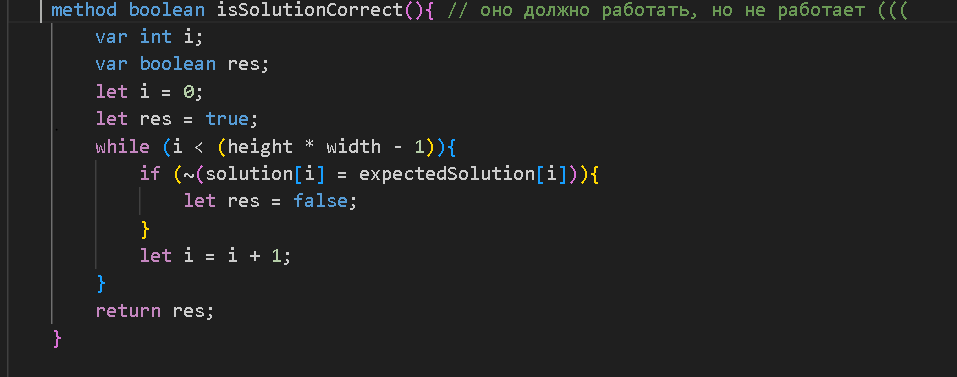

ПЛЮСЫ:
отдельный респект за комментарии, очень удобно, т.к быстрее разбираешься в коде

код реализует игру-головоломку

логика игры вылядит корректной

присутствует разнообразие уровней 

возможность отменить закрашивание это реально круто 

очень крутая идея, ставлю реально большой лайк

круто, что всё работает плавно и без миганий экрана(мы просто сами столкнулись с этими миганиями экрана при разработке)

можно добавить опцию "назад" в экране выбора уровня.

МИНУСЫ:
хотелось бы добавить что-то по типу рестарта(продолжение игры),что если неправильно ответил,то продолжаешь решать кроссворд

А?

конечно же поработать над вот этой частью кода

хорошо было бы разделить отрисовку интерфейса на компоненты

можно было бы вынести числа для координат экрана в константы(класс UI), ну в принципе можно было бы в некоторых местах заменить "магические числа" на константы

